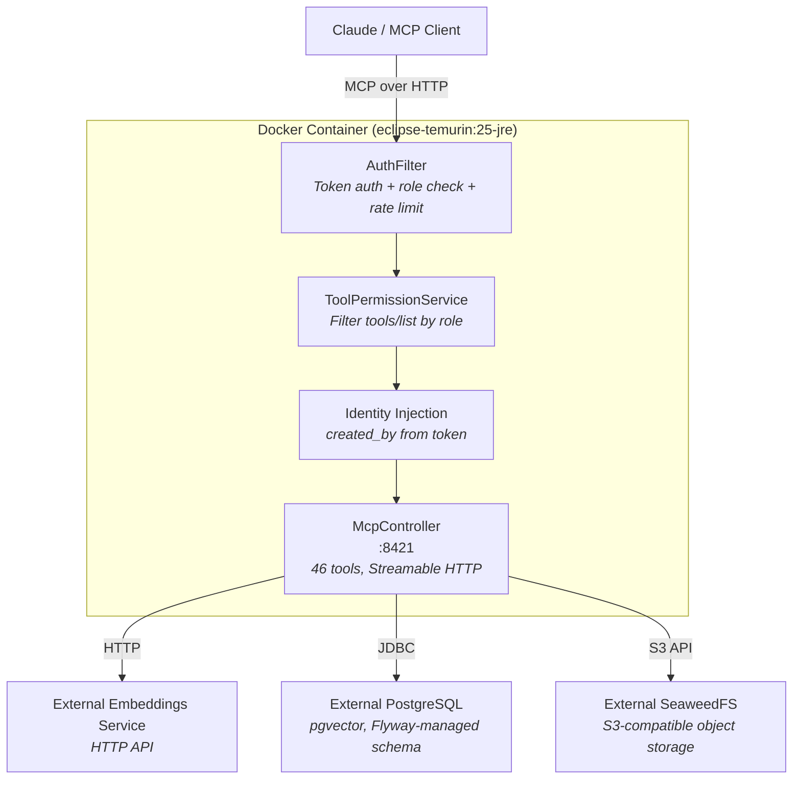
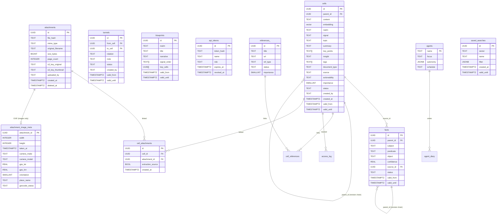

# Architecture

## Data Model

### Attachment ingestion

Each file upload (via `upload_attachment` or `POST /api/attachments`) automatically creates a new `pending` Cell. For PDF files, the page count is determined at ingest (via Apache PDFBox) and stored in `attachments.page_count` (INTEGER, `null` for non-PDF types). This field is exposed in the `get_cell` `attachments[]` list, `get_attachment_info`, and `list_attachments` responses. The cell content is set to the text extracted from the file; if no text could be extracted, the original filename is used as a fallback. The Classifier agent picks up `pending` cells asynchronously and enriches them with summary, key points, insight, and tags. The link between the attachment and its extraction cell is recorded in `cell_attachments` with `extraction_source = true`. If the caller also supplies an existing `cell_id`, a `related_to` tunnel is created between the new extraction Cell and the supplied cell.

### Image EXIF & geolocation

Image attachments (`image/*`) get a row in `attachment_image_meta` (1:0..1 with
`attachments`, only images get a row), populated synchronously at ingest by
`ExifExtractor` (the `metadata-extractor` library): pixel `width`/`height`, capture
date (`taken_at` from EXIF `DateTimeOriginal`, interpreted as UTC — EXIF carries no
timezone, so cross-timezone sort order can be off by the local UTC offset), `camera_make`/
`camera_model`, GPS `gps_lat`/`gps_lon`, and EXIF `orientation`. Thumbnails are rotated
upright per the EXIF orientation flag. EXIF failures never abort ingest.

When GPS coordinates are present, ingest publishes a `GeocodeRequestedEvent` and
`GeocodingService` (async, `@TransactionalEventListener` AFTER_COMMIT) reverse-geocodes them to a `place_name`
("City, CC") via a Nominatim endpoint, caching by rounded coordinates and throttling to
≤1 request/second. The resolution state is tracked in `geocode_status`
(`none` | `pending` | `done` | `failed`).

A one-time idempotent startup backfill (`ImageMetaBackfillRunner`) populates metadata for
images uploaded before this feature existed. The `list_media` MCP tool reads this table
for the photo gallery.

Configuration (`hivemem.geocoding.*`):

| Property | Default | Purpose |
|---|---|---|
| `hivemem.geocoding.enabled` | `true` | Master switch for reverse-geocoding |
| `hivemem.geocoding.base-url` | `https://nominatim.openstreetmap.org` | Reverse-geocode endpoint |
| `hivemem.geocoding.user-agent` | `HiveMem/1.0 (+https://github.com/visterion/hivemem)` | Required by Nominatim usage policy |

### Saved searches

The `saved_searches` table persists named filter presets for the Scans explorer UI. Each row belongs to an `owner` (token name) and stores the filter state as a `JSONB` blob. Soft-deletion is handled via `valid_until`; active rows have `valid_until IS NULL`. An index on `(owner) WHERE valid_until IS NULL` keeps lookups fast per user.

### Per-document confidence aggregate

The `facts` table has a `REAL confidence` column (range `[0, 1]`). The `get_cell` tool exposes a `confidence` optional field (requested via `include=['confidence']`) that is computed as `AVG(confidence) FROM active_facts WHERE source_id = cell.id`. The same aggregate is available in `list_documents` rows. Both return `null` when a cell has no active facts.

## Security & Capability Matrix

Every HiveMem tool is mapped to a specific role to ensure least privilege. Write operations (excluding agents) and admin functions are protected by RBAC.

| Category | Tools | Access Role | Data Flow | HITL Required? | Description |
|---|---|---|---|---|---|
| **Search** | `search`, `search_kg`, `quick_facts`, `time_machine`, `facet_count` | `reader` | Read Only | No | 6-signal semantic & keyword search. `search` supports optional `tags` (match-ANY array) and `status` filters. `facet_count` returns aggregate counts grouped by `tag`/`status`/`realm`/`year`/`signal`, plus `fact:<predicate>` fields (allow-listed: `vendor`, `party`, `amount_total`, `value_per_period`, `document_date`, `due_date`, `invoice_number`, `contract_number`). |
| **Read** | `status`, `get_cell`, `list`, `traverse`, `wake_up`, `get_blueprint`, `history`, `pending_approvals`, `reading_list`, `list_agents`, `diary_read`, `list_attachments`, `get_attachment_info`, `list_saved_searches`, `list_media` | `reader` | Read Only | No | Navigation and context retrieval. `get_cell` supports `include=['confidence']` for the per-document average fact confidence (nullable). |
| **Write** | `add_cell`, `kg_add`, `kg_invalidate`, `revise_cell`, `revise_fact`, `reclassify_cell`, `update_identity`, `update_blueprint`, `upload_attachment`, `save_search`, `delete_saved_search`, `add_tags`, `remove_tags`, `bulk_tag`, `bulk_reclassify` | `agent` | Propose Change | Yes (for Agents) | Append-only knowledge capture; tag management; saved-search persistence. |
| **Tunnels** | `add_tunnel`, `remove_tunnel` | `agent` | Link Discovery | Yes | Cell-to-cell semantic linking. |
| **Approval** | `approve_pending` | `admin` | Commit Change | Yes | Batch approve or reject pending agent writes. |
| **Agent** | `register_agent`, `list_agents`, `diary_write`, `diary_read` | `admin` | Fleet Management | Yes | Autonomous fleet orchestration. |
| **References** | `add_reference`, `link_reference`, `reading_list` | `agent` | Metadata | No | Source and citation tracking. |
| **Admin** | `health`, `queen_runs`, `queen_run_detail` | `admin` | System Management | Yes | DB connection, extensions, counts, disk. `queen_runs`/`queen_run_detail` fetch Queen/Bee run history and event timelines from Vistierie. |

## Configuration

| Variable | Default | Description |
|---|---|---|
| `HIVEMEM_JDBC_URL` | (required) | JDBC connection string to PostgreSQL |
| `HIVEMEM_DB_USER` | (required) | PostgreSQL username |
| `HIVEMEM_DB_PASSWORD` | (required) | PostgreSQL password |
| `HIVEMEM_EMBEDDING_URL` | `http://localhost:8081` | URL of the external embeddings service |
| `HIVEMEM_EMBEDDING_TIMEOUT` | `PT5S` | HTTP timeout for embedding requests (ISO 8601 duration) |
| `SERVER_PORT` | `8421` | Port for the MCP server |

### `ranked_search` PostgreSQL function

The `ranked_search` stored function powers the `search` tool. It is **not** managed by Flyway; instead it is recreated on every startup by `EmbeddingMigrationService` from an in-code template. This is intentional — the function signature must stay in sync with the embedding vector dimension, which can change between deployments. As of SP-C1 the function accepts the optional parameters `p_tags TEXT[]` (match-ANY array overlap filter) and `p_status TEXT` (filter by cell status, default `committed`).

## Security & Compliance

- **Privacy First:** HiveMem is 100% self-hosted. Your data never leaves your infrastructure.
- **Auditability:** All tool calls and authentication events are logged to `/data/audit.log`.
- **SafeSkill Score:** **100/100 (Verified Safe)**. See [SafeSkill Report](https://safeskill.dev/scan/visterion-hivemem).
- **Transparency:** 7/7 points. See [SAFE.md](../SAFE.md) for the security manifest.
- **Human-in-the-Loop:** All agent writes require manual approval via `approve_pending`.

## Vistierie Integration (Queen + Bees)

HiveMem delegates agent scheduling and subagent dispatch to **Vistierie** — the agent runtime running on LXC 102. HiveMem is already a Vistierie tenant (used for `/llm/*` summarizer and vision calls); the Queen + Bees feature reuses that tenancy.

### Outbound: agent registration

On startup (when `hivemem.queen.enabled=true`), `VistierieAgentBootstrap` (in `com.hivemem.queen`) performs idempotent `PUT`/`POST` calls to Vistierie's `/agents` endpoint via `VistierieAgentClient`, registering two agent definitions:

- **`isolated-cell-bee`** — subagent; finds cells with no tunnels and proposes candidate connections.
- **`queen`** — cron agent; surveys knowledge and dispatches the Bee on a configurable schedule.

HiveMem authenticates these calls with the existing `HIVEMEM_VISTIERIE_TOKEN` (the same credential used for LLM calls).

### Inbound: `/vistierie/**` callbacks

Vistierie calls back into HiveMem over the `hivemem-net` Docker network via three endpoint groups:

| Path | Auth header | Purpose |
|---|---|---|
| `POST /vistierie/tools/find_isolated_cells` | `hivemem.queen.webhook-token` | Returns cells that have no outbound tunnels |
| `POST /vistierie/tools/read_cell` | `hivemem.queen.webhook-token` | Returns full cell detail for a given cell ID |
| `POST /vistierie/tools/search_similar_cells` | `hivemem.queen.webhook-token` | Returns cells semantically related to the given cell across all realms (excluding the cell itself) |
| `POST /vistierie/runs/done` | `hivemem.queen.completion-webhook-token` | Receives the Queen's aggregated output and writes each proposal as a `pending` tunnel |

All four endpoints live under `/vistierie/**`, which is **exempt from the global `AuthFilter` and `SessionAuthFilter`**. Each request is authenticated by a constant-time bearer-token check against the respective config property.

### Write isolation

HiveMem remains the **sole writer**. The Bee only proposes; `POST /vistierie/runs/done` ingests the aggregated proposals and inserts each as a `pending` tunnel. Those entries then flow through the existing approval workflow (`approve_pending`) before any change is committed to the knowledge graph.

### Audit / scheduling / kill switch

Scheduling (cron ticks), subagent dispatch (context-shielding), per-run cost accounting, and the per-tenant kill switch are all **owned by Vistierie** — stored in its `runs` and `llm_calls` tables, not duplicated in HiveMem. To halt all Queen/Bee activity, issue `POST /admin/tenants/hivemem/kill` on the Vistierie admin API.

> **Budget requirement:** The Vistierie tenant and each agent must have a daily/monthly budget set, or every cron tick returns 403. See the [Operations runbook](operations.md#queen--bees-on-vistierie-lxc-102) for the setup commands.

### HiveMem → Vistierie task dispatch (new direction)

The consumption pipeline is the **first instance of HiveMem initiating a
Vistierie run** rather than merely registering agents and waiting for Vistierie
to call back. When a multi-page PDF arrives in the consumption folder,
`VistierieSeparationClient` POSTs directly to
`/agents/document-separator/run`, supplying the page digests inside the run
`payload` and a `completion_webhook` URL that Vistierie calls when the
separation run finishes. HiveMem stores the returned `run_id` to correlate that
callback.

This establishes a new request/response pattern on top of the existing
callback-based integration:

| Direction | Mechanism | Who initiates |
|---|---|---|
| Agent registration | PUT/POST `/agents` | HiveMem (startup) |
| Tool calls during a run | POST `/vistierie/tools/**` | Vistierie (inbound) |
| Queen completion | POST `/vistierie/runs/done` | Vistierie (inbound) |
| **Task dispatch (new)** | **POST `/agents/{name}/run`** | **HiveMem (outbound, on demand)** |
| Separation result | POST `/vistierie/separation/done` | Vistierie (inbound) |

The intended long-term direction is for **all generative LLM work to live in
Vistierie** — models, budgets, scheduling, and audit traces owned there — while
HiveMem retains only local embedding inference. The consumption pipeline's
dispatch pattern is the first step toward that model.

### Queen-Log UI

The Queen-Log UI lets admins inspect past Queen and Bee runs without leaving HiveMem. The data path is:

1. The UI calls the `queen_runs` (list) or `queen_run_detail` (single run) MCP tools — both are **admin-only**.
2. Those tools delegate to `QueenRunsService`, which calls `VistierieRunsClient`.
3. `VistierieRunsClient` first attempts `GET /admin/runs` on Vistierie using the optional `HIVEMEM_QUEEN_VISTIERIE_ADMIN_TOKEN`. This admin endpoint includes per-run cost accounting (`llmCalls`, `costMicros`). If no admin token is configured, it falls back to the tenant-scoped `GET /runs` endpoint (same `HIVEMEM_VISTIERIE_TOKEN` used for LLM calls), which returns the same run list but without cost fields.
4. For run detail, `VistierieRunsClient` calls the tenant endpoint `GET /runs/{id}` for run metadata and `GET /runs/{id}/events` for the Vistierie event timeline; these are combined into the `queen_run_detail` response.
5. The approval queue shown alongside run history reuses the existing `pending_approvals` and `approve_pending` tools — no new endpoints or DB tables are required.

On a Vistierie outage, both tools degrade gracefully: `queen_runs` returns `{items:[],total:0,costAvailable:false,unavailable:true}` and `queen_run_detail` returns `{run:{},events:[],unavailable:true}`, allowing the UI to display an appropriate offline notice.

## Language / i18n

The UI is bilingual (German + English), German-first. The startup default language
comes from a global backend property `hivemem.language` (env `HIVEMEM_LANGUAGE`,
default `de`), delivered to the SPA in the `wake_up` response as `default_language`.
The user can switch language in Settings; that choice is stored in `localStorage`
(`hivemem_locale`) and overrides the backend default on subsequent visits.

The summarizer's output-language default inherits the same global value
(`hivemem.summarize.language` defaults to `${HIVEMEM_LANGUAGE}`), but keeps its own
override `HIVEMEM_SUMMARIZE_LANGUAGE`.
